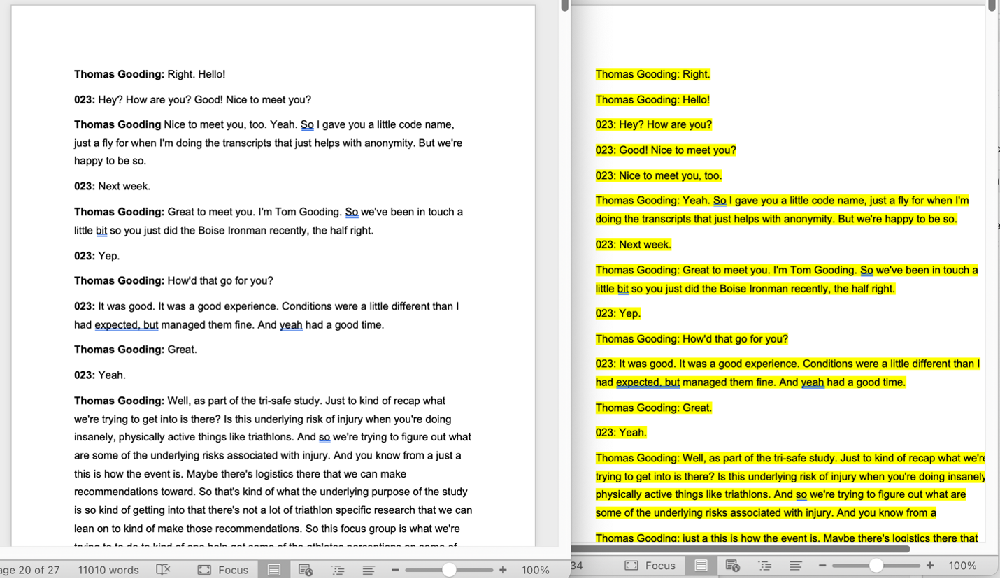
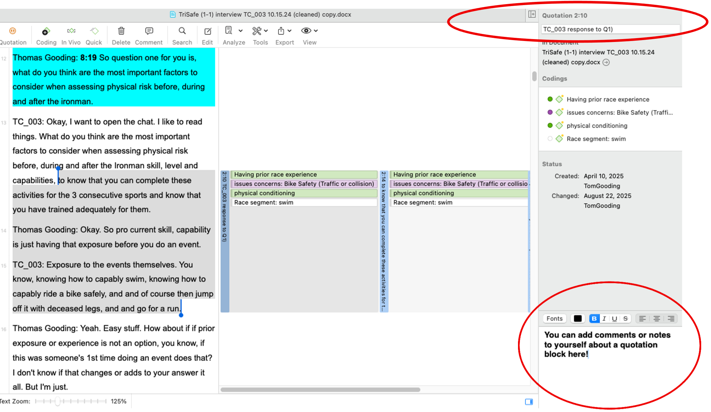
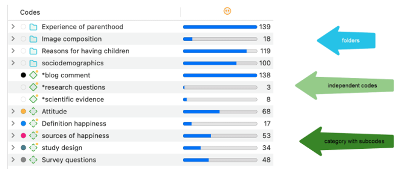
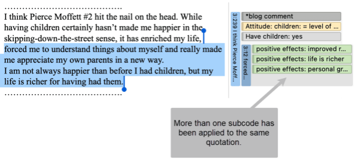
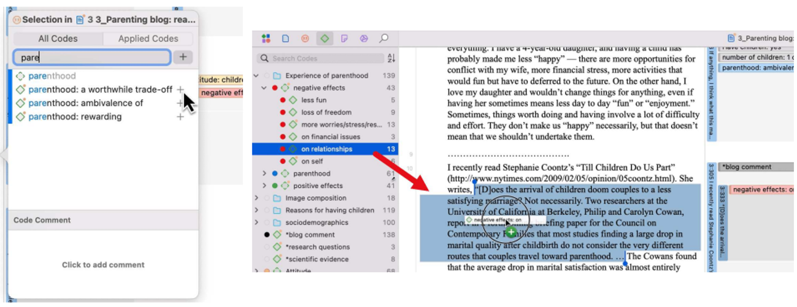
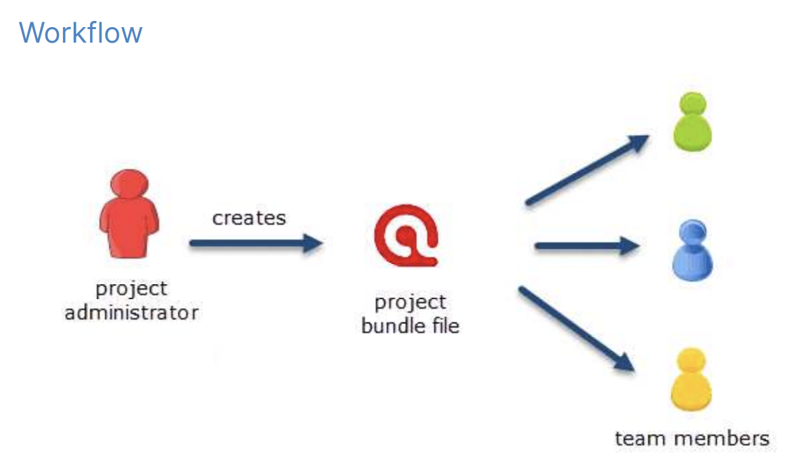
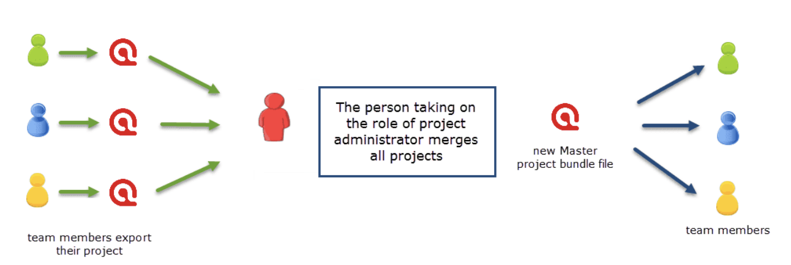
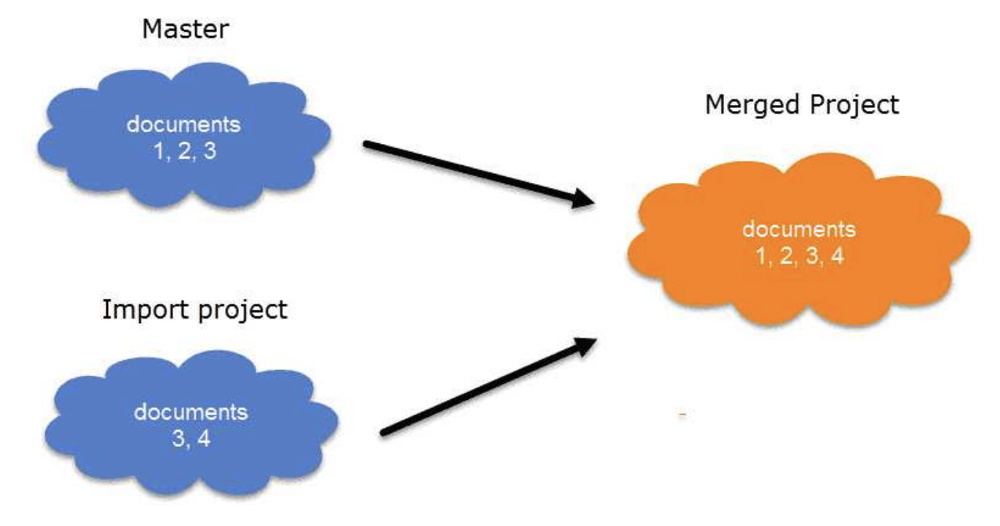
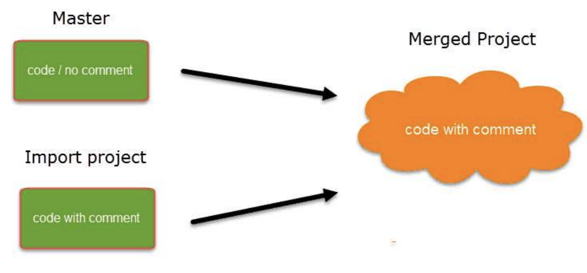
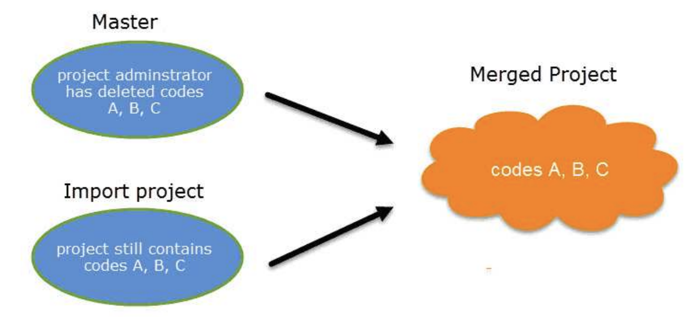

# ATLAS.ti walkthrough for Coding and Qualitative Analysis

### Brief Introduction.
This ATLAS.ti walkthrough was created in August 2025 and only discusses features that were used by the WSU Occupational Sleep Medicine Group researchers for their specific qualitative analyses (i.e., transcript cleaning and subsequent coding of textual data).

Atlas.TI has many different features to use for qualitative data analysis. Before you begin your analysis, it’s important to know that not ALL features will be used for your qualitative content analysis. The appropriate use of some features (e.g., calculation of intercoder agreement) require certain guidelines to be followed when building a code system and applying codes to transcripts. 

## Downloading and accessing ATLAS.ti

1. go to [ATLAS.ti.com](https://atlasti.com/)
- click on 'My ATLAS.ti'
- Enter credentials:
  - **username:** ********
  - **Password:** ********
  
2. Download ATLAS.ti for Windows or Mac, depending on your device.
- **Note:** The Mac and PC versions of ATLAS.ti have the same features but slightly different layouts. This walkthrough was made with the Mac version of ATLAS.ti. The main difference is that Mac users will find the toolbar and options at the top of their screen whereas PC users will find the toolbar and option in their ATLAS.ti program itself (similar to Microsoft Word).

3. Download and install ATLAS.TI 
 - Enter the credentials from step 1. 
 - If/when you get a notification that "no free seats or user licenses..."
   - Go to the web browser where you downloaded ATLAS.ti and **click** "Free up my Seats"
 - We only have one license for the OSMG lab but somehow this works and we've managed to have ~5 different users work in ATLAS.ti this way. 

4. Proceed to log into ATLAS.ti to begin your project. 

## Opening and Starting a Project in ATLAS.ti
 
1. Click ‘new project’ to create a new ATLAS.ti project or ‘import project’ to import a previously saved and exported version of an ATLAS.ti project. 
   
2. Click the ellipses for additional options. 
- When working on a project, **it is important to upload to cloud periodically** (e.g., at the end of the day). Otherwise, your progress is only saved locally on your desktop and won’t be accessible to others. 
- ‘Duplicate’ allows you to create a clone of a project at that exact point in time. I use duplicate project when working with others to allow each person their own version of the project (which will be merged together once all coding is completed). 
  - Creating a duplicate project is not a necessary step but I prefer to do this to create one additional layer of protection against an individual messing up the progress someone else has made (which is likely to happen when multiple individuals are working on the same project). 

## Opening Page of a Project.

- **Left margin** = shortcuts to all items in this project (i.e., documents uploaded, codes created, memos, networks, etc.). 

-  **Important!!!** When opening up a project, __immediately verify that the *current* user__ is yourself. 
   -  Switch to your username, if needed. When you log in under a different user and proceed to work on a project, any progress you make is made under their name and not yours. This is the #1 way a project gets messed up. You will make a bunch of progress only to find that you were working under your colleagues name and not yours. This results in you having to re-code everything under your own name and will disrupt whatever progress your colleague was making that the same time. IF you were both working on the project simultaneously, this will likely cause someone’s progress to be overwritten once you save to the cloud. Always verify upon log in that you are under the correct username.
   
**How to create and switch between users.** 

1. On the toolbar at the top of your screen (For Windows users this is a tab in ATLAS.TI itself):
2. Project --> user management --> show user manager.
3. Identify the appropriate username (current username being used will be in bold). 
4. Create a new user (+), if needed. You will be prompted to provide a username and password. I think the password is optional but have used ‘sleep’ as a generic password when creating usernames for research assistants. 
5. **Note:** The ‘change user’ option under user management doesn’t always accept username + passwords to toggle between usernames. Hence, I just use the show user manager window to change back and forth. 

## Starting a Project.
- **If this is your first time using ATLAS.ti,** I highly recommend reading through the ATLAS.ti user manual for either Mac or Windows, depending on your device. Specifically, the sections about creating quotations and applying codes to create a code book. A majority of this information will be covered below but those sections are critical for qualitative content analysis and the ATLAS.ti user manuals have step-by-step images and commentary that is pretty easy to follow. 
 
- Additionally, check out the ATLAS.ti YouTube channel for additional video walkthroughs.
  - [Here](https://www.youtube.com/watch?v=ym8PaAym9js) is a Youtube video walkthrough of working with quotations.
  - [Here](https://www.youtube.com/watch?v=4CVkB90mrsY) is a YouTube video walkthrough of code categories and sub-codes. 

### Preparing and importing documents into ATLAS.TI for code analysis.

- Documents to import for qualitative analysis will likely be transcripts from focus groups or interviews with study participants that were recorded in Zoom. The automatically transcribed transcripts are recorded in .txt or .vtt formats.
  - For cleaning transcript documents prior to importing these into ATLAS.ti:
    - Find the appropriate file in WSU Zoom Cloud recordings (I use the .vtt filetype but others are viable).
    - Find a website that can convert .vtt to microsoft word filetype (.docx). I use [Ebby.co](https://ebby.co/subtitle-tools/converter/vtt-to-docx)
    - Upload the .vtt file and select .docx as the "convert to" option and download the word document. 

A ‘raw’ transcript file in a .docx format will be very long as any pause in the audio recording will cause the transcribed conversation to begin a new line of text. **To reduce the length and to manually clean the transcript data,** use the following steps:

1.	Highlight the entire transcript document in yellow (yellow = to be cleaned). 
2.	Place each speaker’s name in bold to easily identify who is speaking. 
3.	Condense the consecutive lines of text that belong to the same speaker (TG may be speaking for 15 lines resulting in 15 lines that all indicate ‘TG’ is speaking). 
a.	I place each speaker’s name in bold to easily identify who is speaking.
b.	I condense the lines of text so that the speaker is only identified once until a new speaker is detected in the text.
4.	Using timestamps from the WSU Zoom video chat/text box (in Zoom itself, not the transcript) identify the timestamps for each question/prompt and add these to the transcripts themselves highlighted and in bold (this helps with knowing what part of the conversation you’re in when there are 30+ pages of textual data to code).
    - For any part of the transcribed dialogue that is unclear, find the appropriate moment in the Zoom video/audio recording and identify what the text transcription was supposed to be. Make the necessary correction. 
    - If a speaker is using abbreviations or mentions something unclear, place a comment in brackets [ ] to provide context and highlight the bracketed information so that coders know that wasn’t part of the dialogue. (e.g., “afib [atrial fibrillation] can be a life threatening cardiac emergency.”)

> Example of cleaned vs. raw transcript. Notice the cleaned document is 7 pages shorter than the raw file. That is how much additional spacing Zoom auto transcribing creates due to the pacing of speech.

### Importing cleaned transcripts into ATLAS.ti. 

- This is done in the toolbar at the top of the Mac screen (when ATLAS.ti is open) under the ‘documents’ tab. For Windows users, there is a specific “documents” tab in ATLAS.ti itself. 
  
- It’s important to note that transcript files should be uploaded in word (.docx) format. Qualitative Analysis can occur with multiple media types (newspapers, videos, newspapers, etc.) and PDFs will be read as images, hence I recommend word formatting for all transcribed audio data.

## Creating Quotations and Building a Code Book (Code System).

Now the fun begins. The coding of textual data (i.e., transcripts) is an iterative process meaning you are likely going to read and code through a document multiple times as your code system is built. Generally speaking, you should:
1.	Read through a document and apply quotations to relevant text.
    - You can simply create quotations to interesting text and don’t necessarily have to apply code (yet).
    - If/when you find a really interesting or useful quote, it’s recommended to add the quote itself to a memo. These pull quotes can be used to exemplify a concept or theme from your qualitative content analysis in a future manuscript.
2.	As you’re reading and pulling quotations, add relevant codes as appropriate to begin building your code system. 
3.	After going through a few transcripts (~3 documents), look at the codes you’ve generated and try to establish an initial system or hierarchical structure that these codes may fall into. 
    - (TG): Personally, I like to create a folder for each research aim question, then try to add appropriate independent codes and code categories. 
4.	When meeting with other coders on the research team, discuss the codes you’ve applied as you review a transcript together and discuss whether or not each code applied is relevant or should be revised. 
    - Ideally have 3 coders and either reach consensus about a code or have a vote (democracy wins). 
    - New codes may be generated during subsequent transcript analysis; some codes may be split into multiple independent codes; other codes may be merged together into one code. Again, this is an iterative process.
5.	Continue on with these steps throughout the remaining documents. 
6.	Once all documents have been coded and reviewed as a team, go back through each document as a team and verify the final iteration/placement of codes. 
    - **This final cleaning is an important step** as it allows you to verify the use of each code after your code system is theoretically complete. You still might find places to apply a newly generated code or revise a code that no longer fits (i.e., splitting or merging a code). 
    - Using the code manager tab is helpful as it will tell you where codes have been placed by which document, which paragraph, and which quotation box. 

**To create a quotation box**, drag and select the desired bit of text, rick click, and select ‘create quotation.’ You can also name a quotation box in the upper section of the right toolbar and add comments about the quotation box in the lower section of the right toolbar. 

> Example of a quotation box. Upper right box indicates title of quotation (optional); lower right box is comment box for adding notes about quotation (optional). Note the color coordination for different code categories (green and purple) with two subcodes from the same code category being applied to the same quotation (not appropriate for intercoder agreement analysis, but otherwise completely fine). 

### Independent codes, code categories, subcodes.
There are a few different methods available when developing a code system (code book). The purpose of applying codes to textual data (e.g., transcripts) is to identify and quantify concepts or themes that the textual data represents.

**Independent codes** are codes that are standalone, meaning they are applied to textual data and do not fit within a hierarchy of other codes. 
- Sleep (independent code, not tied to another level of coding). 
  
**Code categories** are clusters of code that fall within a certain overarching theme. For example, a code category may be “emotion” with sub-codes of different emotions such as anger, sadness, happiness, etc.
- Emotion (code category) with subcodes (below)
  - Anger
  - Sadness
  - Happiness
  
**Folders** are a good way to add another layer to your code hierarchy. You can only code one (independent codes) to two levels (code category + subcodes) levels deep. But, you can add codes to folders (and folder within folders etc.).

### Code ‘groundedness’ or intensity.
The more use a code has, the higher its intensity/frequency/”groundedness” is (these all generally refer to the same thing). For an independent code, this would indicate the number of quotations that the code has been applied. For a code category, the groundedness of a code category is the sum of how many times the category’s subcodes have been applied. 

>**Note:** The code category can have a lower groundedness than the sum of its subcodes’ groundedness if subcodes from the same category have been applied to the same quotation.  Important! If planning to use intercoder agreement analysis, subcodes from the same code category must be applied in a mutually exclusive manner. Meaning that only one emotion from the code category emotion can be applied to any one quotation. 

- **Code Cleaning Tip:** Finding the discrepancies in code count/frequency (groundedness) can be a good way to search for errors when cleaning the data after merging projects from each researcher. If three researchers are serving as coders, then the code count of each code should be a number divisible by three. If you find a code count that isn’t divisible by the number of coders, it’s likely someone did not properly apply a code somewhere. 

### Creating and applying Codes. 
On Mac, codes can be applied to quotations by either right clicking a quotation box and selecting ‘apply code’ or by dragging and dropping existing codes from the lefthand toolbar into the appropriate quotation box. 

> **Left:** Applying a code by right clicking quotation box and typing a code. This works for applying new codes and searching/filtering through existing codes (via typing). **Right:** applying an existing code by drag and drop. 

## Team Projects: Distributing and Merging project file bundles.
Qualitative analysis will often be a team-based project in which multiple researchers work together as coders for a given project. There are some very important considerations the project administrator (lead researcher) should be aware of **BEFORE** distributing a project file bundle to other coders on the research team. 
- The "Teamwork" section of the ATLAS.ti user manual begins ~472 of the ATLAS.ti user manual (full version). [Here](https://manuals.atlasti.com/Mac/en/manual/ATLAS.ti_ManualMac.pdf?_ga=2.80066836.2090782870.1756402505-550072629.1753392187&_gac=1.85253867.1753392216.Cj0KCQjws4fEBhD-ARIsACC3d29cvDZQvokCywljzivdPXERZreZ0JTd34auBSQv6RbLuxXgtm7sI20aAh-aEALw_wcB&_gl=1*mosze1*_gcl_aw*R0NMLjE3NTMzOTIyMTYuQ2owS0NRandzNGZFQmhELUFSSXNBQ0MzZDI5Y3ZEWlF2b2tDeXdsanppdmRQWEVSWnJlWjBKVGQzNGF1QlNRdjZSYkx1eFhndG03c0kyMGFBaC1hRUFMd193Y0I.*_gcl_au*MjcyNTc5MjkwLjE3NTMzOTIxODg.*_ga*NTUwMDcyNjI5LjE3NTMzOTIxODc.*_ga_K459D5HY8F*czE3NTY0MDI1MDUkbzkkZzEkdDE3NTY0MDI3MDEkajU0JGwwJGgyMDcxNjcwODg1) is a link to the full user manual.

## Setting up a Team Project. 
- **This is a very important section if you will be co-coding with other individuals on a project**

**Project Worklow.** 
When working on a team project, team members must not edit documents (unless everyone is working on different documents). If a team member edits the same document that other team members have in their project bundles, these won't be able to be merged as ATLAS.ti will create these as unique documents. 

1. The project administrator (PA)(lead researcher) creates a **master project** in ATLAS.ti. 
2. The PA adds **ALL** documents and similar materials to the master project file, prior to distribution to the other team members. 
3. The PA saves the project and exports the project (called a "project file bundle.")
4. All associated team members **import** the project file bundle into their ATLAS.ti program and get to work. 

### Avoiding Pitfalls.
- To share a project with team members, export the project file as previously describe, **don't** simply duplicate the project and give those copies to your teammates. When it comes time to merge everyone's projects, the code systems will be duplicated/triplicated by X number of sub-projects being merged together. 
  - This can be reconciled by merging all multiples of each code but this is very tedious and time consuming.
  - To merge duplicate codes (e.g., Code A and Code A(2)), make sure you merge in the appropriate order. To manually drag and merge these two codes, Code A would be dragged onto Code A(2) to perform the correct merge (it seems counterintuitive but that's how it works, hence the creation of this guide).

### Merging files back together
Once coding and other related tasks have been completed by all team members, it is time to merge all subprojects back into the master project bundle. 
- To combine the work, each team member exports a project file bundle and sends it to the PA. The PA then merges all subprojects and creates a new master file.
- If team work on the project needs to continue, the workflow should continue on with these steps whereby the PA exports a project bundle file and the team imports and work continues, as needed. 

**Note:** It is very important that only the project administrator uploads documents into the master project file for eventual distribution. If the exact same document is uploaded to project files individually by team personnel, ATLAS.ti treats these files as distinct documents even though they're identical. 

This is because when an entity is created in ATLAS.ti—regardless of if it is a document, code, memo, network, a group etc.—this entity receives a unique ID, comparable to a fingerprint. That means, anything created outside the master project file will be treated as a distinct entity—even if it is identical to what was created in other project files. 

For example: If a user Tom has created a code with the name sunshine, and a user Anne also has created a code with the same sunshine in her project, these two codes are not identical as they have been created on different computers and in different project. Therefore, they will have a
different ID. 

If you merge Tom's and Anne's project, the merged project will contain two codes: sunshine and sunshine (2). If the meaning of both codes is the same, and you want to keep one sunshine code only, you can merge the two codes manually. (**Note:** This is the actual manual example of the Pitfall recently mentioned). 

### Additional Information on Merging Projects.

**Groups are Additive.**

>A Group B with documents {1, 2, 3} in the Master project merged with a Group B containing documents {3, 4} in the Import project will result in Group B= {1, 2, 3, 4} in the merged project. 

If there is a code C in the Master project that has no comment, and a code C in the Import project that has a comment, the merged procedure will add this comment to the merged project.

> In the case of an unsolvable conflict - code C in the Master project has a comment, and code C in the Import project also has a comment - the user can define which of the two conflicting entities will win.

_ovreride_local_changes.png)
> If the comment of the Master project should be kept, you need to select the option **Keep**. If the comment of the Import project should be kept, you need to select the option **Override**.

> Currently, you can only decide for all conflicts whether the Master project should "win" or the import project. 

If you want to clean up a project, it is best done with a fresh Master-project after merging and **BEFORE** distributing the new master file to all team members.

